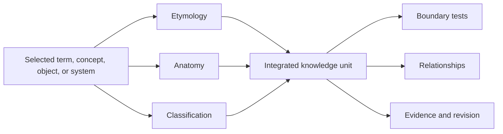
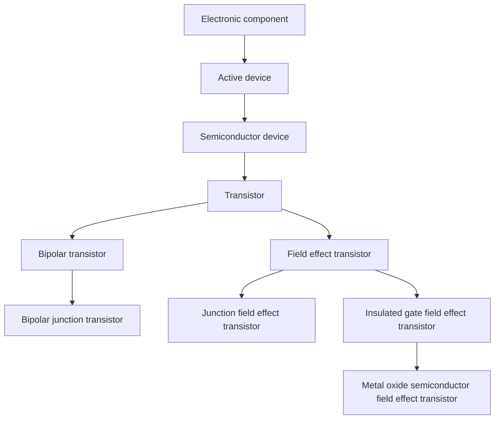
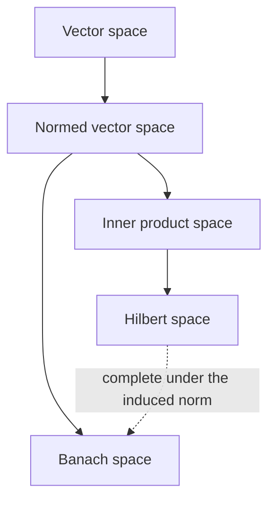

# Knowledge-System-How-To
A repository for organizing knowledge systems the way Onri does it. 

---

[](https://creativecommons.org/licenses/by/4.0/)

**Knowledge-System-How-To** is an open knowledge repository for learning and documenting any subject by combining etymology, anatomy, and classification. Etymology traces the origin and semantic development of a term, anatomy resolves the internal structure of the corresponding concept or system, and classification places that subject among parent categories, sibling concepts, subtypes, and boundary cases.

> Strong grounding joins lexical lineage, internal organization, and relational placement.

## Contents

1. [Primer](#primer)
2. [Core framework](#core-framework)
3. [Knowledge unit standard](#knowledge-unit-standard)
4. [Classification representations](#classification-representations)
5. [Worked examples](#worked-examples)
6. [Repository organization](#repository-organization)
7. [Contribution standard](#contribution-standard)
8. [License and attribution](#license-and-attribution)
9. [Sources used in this README](#sources-used-in-this-readme)

## Primer

A definition identifies a subject, although a durable knowledge system must also explain how that subject acquired its name, what gives it structure, how its parts interact, where it belongs, and where its boundaries fail. The repository therefore treats each topic as a **knowledge unit** built from three primary views and several supporting checks.

| View | Primary question | Typical output |
|---|---|---|
| Etymology | Where did the term come from, and how did its meaning change? | Root forms, coinage, historical context, semantic shifts |
| Anatomy | What constitutes the subject, and how do its parts or axioms interact? | Components, operations, interfaces, scales, invariants, stages |
| Classification | Where does the subject belong relative to broader and narrower concepts? | Parent categories, siblings, subtypes, facets, boundary cases |

The word **anatomy** is used in a generalized sense. A physical device has components and interfaces, an abstract mathematical object has axioms and operations, a process has inputs and transformations, and an institution has roles and rules. Each case permits an internal structural analysis even when no biological body is present.



## Core framework

A complete entry develops in seven stages.

1. **Scope the subject.** State whether the entry concerns a word, concept, physical object, process, field, method, or institution.
2. **Trace the etymology.** Record source languages, roots, coinage, early usage, semantic changes, and any mismatch between historical and current meaning.
3. **State the current definition.** Use a domain appropriate source and distinguish formal definitions from informal teaching descriptions.
4. **Map the anatomy.** Resolve components, functions, operations, interfaces, scales, inputs, outputs, and invariants.
5. **Construct the classification.** Identify broader classes, sibling concepts, subtypes, independent facets, and cross links.
6. **Test the boundaries.** Add counterexamples, ambiguous cases, historical exceptions, and common confusions.
7. **Attach provenance.** Cite sources, identify evidence quality, record authorship, and maintain a revision history.

## Knowledge unit standard

Every mature knowledge unit should contain the following fields. The reusable file is available at [`templates/knowledge-unit-template.md`](templates/knowledge-unit-template.md).

| Field | Required content |
|---|---|
| Title and scope | Canonical name, aliases, domain, and scope boundary |
| Working definition | A concise current definition with an authoritative source |
| Etymology | Roots, source language, coinage, semantic development, naming logic |
| Anatomy | Constituents, functions, relationships, interfaces, and governing rules |
| Classification | Parent classes, siblings, subtypes, facets, and cross classifications |
| Boundary cases | Near misses, exceptions, overloaded terms, and disputed placements |
| Relationships | Prerequisites, consequences, analogies, contrasts, and applications |
| Examples | At least one representative case and one edge case |
| Sources | Claim level citations with persistent links where available |
| Status | Seed, developing, reviewed, stable, or contested |
| Revision record | Date, contributor, change summary, and source additions |

## Classification representations

A tree works well when every child has one relevant parent under the selected criterion. Many knowledge domains contain multiple inheritance, independent classification axes, or context dependent categories, so the repository supports several representations.

| Representation | Best use |
|---|---|
| Classification tree | Strict nesting under one declared criterion |
| Faceted table | Independent axes such as material, function, scale, or historical period |
| Directed acyclic graph | Multiple inheritance without cycles |
| General knowledge graph | Cross links, feedback, analogy, influence, and dependency |
| Matrix | Comparison across a fixed set of attributes |
| Timeline | Historical development, semantic change, or process sequence |

Each diagram must state its classification criterion. A tree labeled “by operating principle” can differ from one labeled “by material system” without creating a contradiction.

## Worked examples

### Example 1: Transistor

**Working definition.** A transistor is an active semiconductor device in which a control signal regulates current or voltage along another electrical path. Digital circuits frequently use transistors as switches, and analog circuits use them for amplification and signal conditioning.

**Etymology.** Bell Laboratories electrical engineer John Pierce assigned the name *transistor* before the device's public announcement in June 1948. The coinage connected transresistance with the established component name *resistor*, so the term preserved both transfer behavior and circuit function.

**Anatomy.** At the family level, a transistor contains a controlled conduction path and a control interface. A bipolar junction transistor resolves into emitter, base, collector, and two semiconductor junctions. A field effect transistor resolves into source, drain, gate, channel, and a gate junction or dielectric according to subtype. The terminal vocabulary therefore follows the device family.



**Learning yield.** Etymology suggests transfer and resistance, anatomy separates the terminal systems, and classification prevents a bipolar base from being treated as a field effect gate.

Full entry: [`examples/transistor.md`](examples/transistor.md)

### Example 2: Hilbert space

**Working definition.** A Hilbert space is a real or complex inner product space that is complete under the metric induced by its inner product.

**Etymology.** The name is an eponym honoring mathematician David Hilbert. The word *space* identifies a structured mathematical domain whose elements may be finite dimensional vectors, infinite sequences, functions, or other objects satisfying the required axioms.

**Anatomy.** The structure contains a carrier set, a real or complex scalar field, vector addition, scalar multiplication, an inner product, the induced norm, the induced metric, and completeness. Removing completeness leaves an inner product space. Removing the inner product while retaining a complete norm can leave a Banach space.



**Boundary case.** Finite dimensional real and complex Euclidean spaces qualify as Hilbert spaces. An incomplete inner product space requires completion before it qualifies.

**Learning yield.** The anatomy exposes completeness as the decisive structural requirement, and the classification graph shows why a Hilbert space belongs simultaneously within inner product spaces and Banach spaces.

Full entry: [`examples/hilbert-space.md`](examples/hilbert-space.md)

### Example 3: Atom

**Working definition.** The International Union of Pure and Applied Chemistry defines an atom as the smallest particle that still characterizes a chemical element. Its positively charged nucleus carries nearly all of its mass, and its electrons determine its spatial extent and chemical behavior.

**Etymology.** The English word descends from Greek *atomos*, meaning uncut or indivisible. Modern physics established internal atomic structure, so the term now preserves a historical hypothesis even though the contemporary object has divisible constituents.

**Anatomy.** An atom contains a nucleus and an electron system. The nucleus contains a proton number \(Z\), which establishes elemental identity, and a nuclide dependent neutron number. A neutral atom contains \(Z\) electrons. Electron removal or addition produces an atomic ion, and electronic excitation changes state without changing elemental identity.

| Classification axis | Resulting categories |
|---|---|
| Proton number | Chemical element |
| Neutron number at fixed proton number | Isotope |
| Electron balance | Neutral atom, cation, or anion |
| Electronic configuration | Ground state or excited state |
| Nuclear stability | Stable or radioactive nuclide association |

**Learning yield.** Etymology records an abandoned structural assumption, anatomy reveals the internal constituents, and faceted classification preserves element, isotope, charge, and state without forcing every distinction into one parent chain.

Full entry: [`examples/atom.md`](examples/atom.md)

## Contribution standard

Contributions may add knowledge units, improve etymologies, correct structural descriptions, refine classifications, supply stronger sources, or identify boundary cases. Every factual change should include a source proportional to the claim.

1. **Primary or normative evidence** includes standards, original papers, patents, archival records, official technical definitions, and historical documents.
2. **Scholarly secondary evidence** includes peer reviewed reviews, academic monographs, and specialist encyclopedias.
3. **Orientation evidence** includes general encyclopedias, museums, institutional explainers, and reputable etymological references.

## License and attribution

Except where another source or license is identified, the original content in this repository is copyright © 2026 Onri Jay Benally and licensed under the [Creative Commons Attribution 4.0 International License](https://creativecommons.org/licenses/by/4.0/).

CC BY 4.0 permits sharing and adaptation for any purpose, including commercial use, provided that users give appropriate credit, link to the license, and indicate changes. The complete legal code appears in [`LICENSE`](LICENSE).

A recommended attribution is:

```text
Knowledge-System-How-To by Onri Jay Benally is licensed under CC BY 4.0.
Source: https://github.com/OJB-Quantum/Knowledge-System-How-To
Changes: [briefly describe any modifications]
```

Linked materials, quotations, trademarks, and externally authored works retain their respective rights and licenses. Repository entries should identify these materials near their point of use.

## Citation

The repository includes [`CITATION.cff`](CITATION.cff), which allows GitHub to generate a citation from the repository interface. Versioned releases may later be archived with a persistent identifier.

## Sources used in this README

* Creative Commons, [Attribution 4.0 International](https://creativecommons.org/licenses/by/4.0/).
* Computer History Museum, [1947: Invention of the Point Contact Transistor](https://www.computerhistory.org/siliconengine/invention-of-the-point-contact-transistor/).
* Computer History Museum, [The Surface State Job](https://computerhistory.org/blog/the-surface-state-job/).
* National Institute of Standards and Technology, [Semiconductor Glossary](https://www.nist.gov/semiconductors/semiconductor-glossary).
* Encyclopedia of Mathematics, [Hilbert Space](https://encyclopediaofmath.org/wiki/Hilbert_space).
* International Union of Pure and Applied Chemistry, [Atom](https://doi.org/10.1351/goldbook.A00493).
* Online Etymology Dictionary, [Atom](https://www.etymonline.com/word/atom).
* GitHub Docs, [Creating Diagrams](https://docs.github.com/en/get-started/writing-on-github/working-with-advanced-formatting/creating-diagrams).
